# Проектирование системы
## Содержание
1. [Диаграмма использования](#1-Диаграмма-использования)  
1.1. [Описание актёров](#11-Описание-актёров)  
1.2. [Варианты использования (сценарии)](#12-Варианты-использования-сценарии)  
&nbsp;&nbsp;&nbsp;&nbsp;1.2.1. [Зарегистрироваться в приложении](#121-Зарегистрироваться-в-приложении)  
&nbsp;&nbsp;&nbsp;&nbsp;&nbsp;&nbsp;&nbsp;&nbsp;1.2.1.1. [Поток событий](#1211-Поток-событий)  
&nbsp;&nbsp;&nbsp;&nbsp;&nbsp;&nbsp;&nbsp;&nbsp;1.2.1.2. [Диаграмма активности](#1212-Диаграмма-активности)  
&nbsp;&nbsp;&nbsp;&nbsp;1.2.2. [Авторизироваться в приложении](#122-Авторизироваться-в-приложении)  
&nbsp;&nbsp;&nbsp;&nbsp;&nbsp;&nbsp;&nbsp;&nbsp;1.2.2.1. [Поток событий](#1221-Поток-событий)  
&nbsp;&nbsp;&nbsp;&nbsp;&nbsp;&nbsp;&nbsp;&nbsp;1.2.2.2. [Диаграмма активности](#1222-Диаграмма-активности)  
&nbsp;&nbsp;&nbsp;&nbsp;1.2.3. [Просмотреть информацию о шаблоне](#123-Просмотреть-информацию-о-шаблоне)  
&nbsp;&nbsp;&nbsp;&nbsp;&nbsp;&nbsp;&nbsp;&nbsp;1.2.3.1. [Поток событий](#1231-Поток-событий)  
&nbsp;&nbsp;&nbsp;&nbsp;&nbsp;&nbsp;&nbsp;&nbsp;1.2.3.2. [Диаграмма активности](#1232-Диаграмма-активности)  
&nbsp;&nbsp;&nbsp;&nbsp;1.2.4. [Просмотреть шаблон](#124-Просмотреть-шаблон)  
&nbsp;&nbsp;&nbsp;&nbsp;&nbsp;&nbsp;&nbsp;&nbsp;1.2.4.1. [Поток событий](#1241-Поток-событий)  
&nbsp;&nbsp;&nbsp;&nbsp;&nbsp;&nbsp;&nbsp;&nbsp;1.2.4.2. [Диаграмма активности](#1242-Диаграмма-активности)  
&nbsp;&nbsp;&nbsp;&nbsp;1.2.5. [Скачать шаблон](#125-Скачать-шаблон)  
&nbsp;&nbsp;&nbsp;&nbsp;&nbsp;&nbsp;&nbsp;&nbsp;1.2.5.1. [Поток событий](#1251-Поток-событий)  
&nbsp;&nbsp;&nbsp;&nbsp;&nbsp;&nbsp;&nbsp;&nbsp;1.2.5.2. [Диаграмма активности](#1252-Диаграмма-активности)  
&nbsp;&nbsp;&nbsp;&nbsp;1.2.6. [Загрузить шаблон](#126-Загрузить-шаблон)  
&nbsp;&nbsp;&nbsp;&nbsp;&nbsp;&nbsp;&nbsp;&nbsp;1.2.6.1. [Поток событий](#1261-Поток-событий)  
&nbsp;&nbsp;&nbsp;&nbsp;&nbsp;&nbsp;&nbsp;&nbsp;1.2.6.2. [Диаграмма активности](#1262-Диаграмма-активности)  
&nbsp;&nbsp;&nbsp;&nbsp;1.2.7. [Опубликовать загружаемый шаблон](#127-Опубликовать-загружаемый-шаблон)  
&nbsp;&nbsp;&nbsp;&nbsp;&nbsp;&nbsp;&nbsp;&nbsp;1.2.7.1. [Поток событий](#1271-Поток-событий)  
&nbsp;&nbsp;&nbsp;&nbsp;&nbsp;&nbsp;&nbsp;&nbsp;1.2.7.2. [Диаграмма активности](#1272-Диаграмма-активности)  
&nbsp;&nbsp;&nbsp;&nbsp;1.2.8. [Опубликовать загруженный шаблон](#128-Опубликовать-загруженный-шаблон)  
&nbsp;&nbsp;&nbsp;&nbsp;&nbsp;&nbsp;&nbsp;&nbsp;1.2.8.1. [Поток событий](#1281-Поток-событий)  
&nbsp;&nbsp;&nbsp;&nbsp;&nbsp;&nbsp;&nbsp;&nbsp;1.2.8.2. [Диаграмма активности](#1282-Диаграмма-активности)  
&nbsp;&nbsp;&nbsp;&nbsp;1.2.9. [Редактировать шаблон](#129-Редактировать-шаблон)  
&nbsp;&nbsp;&nbsp;&nbsp;&nbsp;&nbsp;&nbsp;&nbsp;1.2.9.1. [Поток событий](#1291-Поток-событий)  
&nbsp;&nbsp;&nbsp;&nbsp;&nbsp;&nbsp;&nbsp;&nbsp;1.2.9.2. [Диаграмма активности](#1292-Диаграмма-активности)  
&nbsp;&nbsp;&nbsp;&nbsp;1.2.10. [Удалить шаблон](#1210-Удалить-шаблон)  
&nbsp;&nbsp;&nbsp;&nbsp;&nbsp;&nbsp;&nbsp;&nbsp;1.2.10.1. [Поток событий](#12101-Поток-событий)  
&nbsp;&nbsp;&nbsp;&nbsp;&nbsp;&nbsp;&nbsp;&nbsp;1.2.10.2. [Диаграмма активности](#12102-Диаграмма-активности)  
&nbsp;&nbsp;&nbsp;&nbsp;1.2.11. [Выйти из учётной записи](#1211-Выйти-из-учётной-записи)  
&nbsp;&nbsp;&nbsp;&nbsp;&nbsp;&nbsp;&nbsp;&nbsp;1.2.11.1. [Поток событий](#12111-Поток-событий)  
&nbsp;&nbsp;&nbsp;&nbsp;&nbsp;&nbsp;&nbsp;&nbsp;1.2.11.2. [Диаграмма активности](#12112-Диаграмма-активности)  
&nbsp;&nbsp;&nbsp;&nbsp;1.2.12. [Удалить шаблон, загруженный другим пользователем](#1212-Удалить-шаблон-загруженный-другим-пользователем)  
&nbsp;&nbsp;&nbsp;&nbsp;&nbsp;&nbsp;&nbsp;&nbsp;1.2.12.1. [Поток событий](#12121-Поток-событий)  
&nbsp;&nbsp;&nbsp;&nbsp;&nbsp;&nbsp;&nbsp;&nbsp;1.2.12.2. [Диаграмма активности](#12122-Диаграмма-активности)  
2. [Диаграммы последовательности](#2-Диаграммы-последовательности)  
2.1. [Обмен между приложение и сервером по протоколу HTTP](#21-Обмен-между-приложение-и-сервером-по-протоколу-http)  
## 1. Диаграмма использования
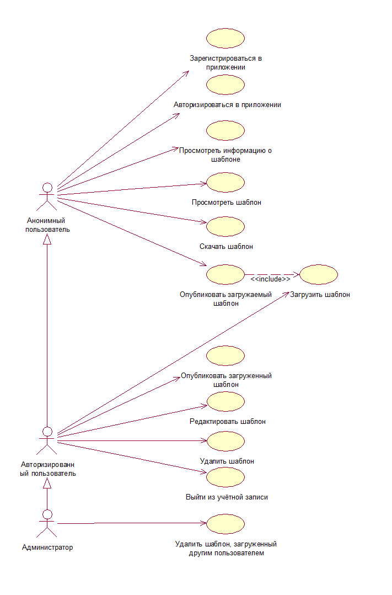
### 1.1. Описание актёров
Описание актёров аналогично [описанию классов пользователей в требованиях к проекту](SRS.md#P2.3.1):

|Актёр|Описание|
|:---|:---|
|Анонимный пользователь|Пользователь, который не прошёл процесс авторизации в системе. Имеет частичный доступ к пользовательскому функционалу системы: может просматривать, скачивать и публиковать шаблоны.|
|Авторизированный пользователь|Пользователь, прошедший процесс авторизации в системе под своим именем или псевдонимом. Имеет полный доступ к пользовательскому функционалу системы: может просматривать, скачивать, публиковать, загружать и редактировать собственные шаблоны.|
|Администратор|Пользователь, прошедший процесс авторизации в системе под своим именем или псевдонимом. Имеет полный доступ к функционалу пользовательскому системы и средствам администрирования: удалять опубликованные шаблоны, не удовлетворяющие требованиям для публикации.|
### 1.2. Варианты использования (сценарии)
Сценарии выполнения вариантов использования описаны с помощью потоков событий и отображены в виде диаграмм активности.  
#### 1.2.1. Зарегистрироваться в приложении
##### 1.2.1.1. Поток событий
**Описание.** Вариант использования "Зарегистрироваться в приложении" позволяет создать пользователю собственную учётную запись.  

**Основной поток.**  
 1. Вариант использования начинается, когда пользователь нажимает кнопку "Зарегистрироваться".  
 2. Приложение перенаправляет пользователя на страницу регистрации.  
 3. Приложение предлагает пользователю ввести данные (имя пользователя, e-mail, пароль).  
 4. Пользователь вводит необходимые данные. Если пользователь покидает страницу, то вариант использования завершается досрочно.  
 5. Приложение проверяет введённые данные. Если уже создана учётная запись с таким именем пользователя, то выполняется альтернативный поток А1.  
 6. Приложение создаёт учётную запись пользователя и сохраняет её в базе данных.  
 7. Приложение перенаправляет пользователя на исходную страницу.  
 8. Вариант использования завершается.  

**Альтернативный поток А1.**  
 1. Приложение информирует пользователя, что уже создана учётная запись с таким именем пользователя.  
 2. Начинается выполнение пункта 3 основного потока.  
##### 1.2.1.2. Диаграмма активности
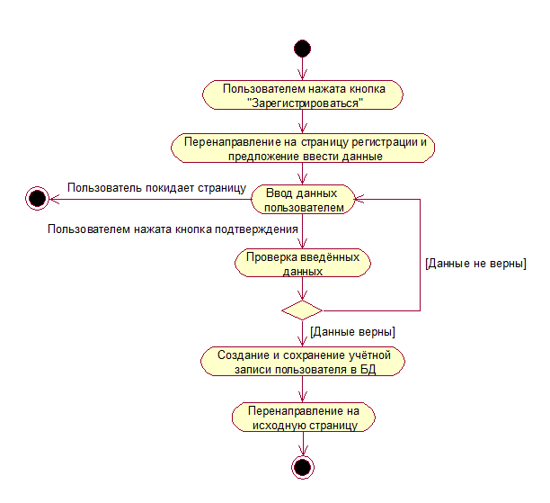
#### 1.2.2. Авторизироваться в приложении
##### 1.2.2.1. Поток событий
**Описание.** Вариант использования "Авторизироваться в приложении" позволяет пользователю войти в приложение, используя собственную учётную запись.  

**Основной поток.**  
 1. Вариант использования начинается, когда пользователь нажимает кнопку "Войти".  
 2. Приложение перенаправляет пользователя на страницу авторизации.  
 3. Приложение предлагает пользователю ввести имя пользователя и пароль.  
 4. Пользователь вводит имя пользователя и пароль. Если пользователь покидает страницу, то вариант использования завершается досрочно.  
 5. Приложение проверяет введённые данные. Если данные не подтверждаются (неверное имя пользователя и/или пароль), то выполняется альтернативный поток А1.  
 6. Приложение перенаправляет пользователя на главную страницу, как авторизированного пользователя.  
 7. Вариант использования завершается.  

**Альтернативный поток А1.**  
 1. Приложение информирует пользователя о том, что введённые данные не верны.  
 2. Начинается выполнение пункта 3 основного потока.  
##### 1.2.2.2. Диаграмма активности
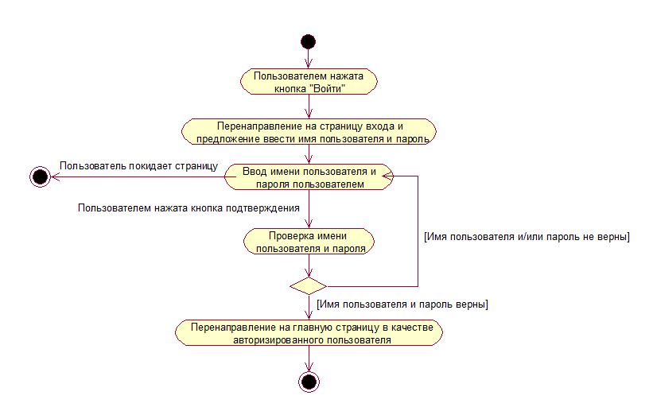
#### 1.2.3. Просмотреть информацию о шаблоне
##### 1.2.3.1. Поток событий
**Описание.** Вариант использования "Просмотреть информацию о шаблоне" позволяет пользователю получить информацию о шаблоне, а также возможность его предварительного просмотра и скачивания.  
**Предусловия.** Пользователь находится на странице отображения шаблонов (главная страница, личная страница).  

**Основной поток.**  
1. Вариант использования начинается, когда пользователь выбирает шаблон и нажимает на него.  
2. Приложение перенаправляет пользователя на страницу отображения информации о шаблоне.  
3. Вариант использования завершается.  
##### 1.2.3.2. Диаграмма активности
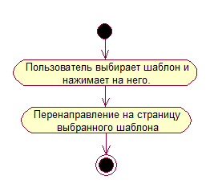
#### 1.2.4. Просмотреть шаблон
##### 1.2.4.1. Поток событий
**Описание.** Вариант использования "Просмотреть шаблон" позволяет пользователю просмотреть шаблон непосредственно в браузере.  
**Предусловия.** Пользователь выполнил вариант использования "Просмотреть информацию о шаблоне" и находится на странице отображения информации о шаблоне.  

**Основной поток.**  
1. Вариант использования начинается, когда пользователь нажимает кнопку "Предпросмотр".  
2. Приложение перенаправляет пользователя на страницу, где открыт документ шаблона.  
3. Вариант использования завершается.  
##### 1.2.4.2. Диаграмма активности
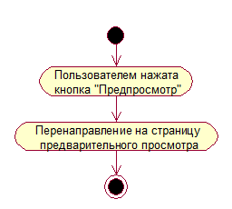
#### 1.2.5. Скачать шаблон
##### 1.2.5.1. Поток событий
**Описание.** Вариант использования "Скачать шаблон" позволяет пользователю сохранить шаблон на локальный диск.  
**Предусловия.** Пользователь выполнил вариант использования "Просмотреть информацию о шаблоне" и находится на странице отображения информации о шаблоне.  

**Основной поток.**  
1. Вариант использования начинается, когда пользователь нажимает кнопку "Скачать".  
2. Приложение отправляет документ шаблона на устройства пользователя.  
4. Вариант использования завершается.  
##### 1.2.5.2. Диаграмма активности
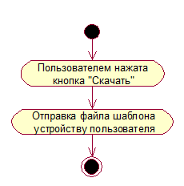
#### 1.2.6. Загрузить шаблон
##### 1.2.6.1. Поток событий
**Описание.** Вариант использования "Загрузить шаблон" позволяет пользователю загрузить шаблон в хранилище.  

**Основной поток.**  
1. Вариант использования начинается, когда пользователь нажимает кнопку "Загрузить/Опубликовать".  
2. Приложение перенаправляет пользователя на страницу загрузки шаблона.  
3. Пользователь указывает необходимые данные (теги, название, описание, загружаемый файл). Если пользователь покидает страницу, то вариант использования завершается досрочно.  
4. Пользователь нажимает кнопку "Загрузить".  
5. Приложение проверяет введённые данные. Если поле название или загружаемый файл не заполнено, то выполняется альтернативный поток А1.  
6. Приложение загружает файл в хранилище.  
7. Приложение создаёт и сохраняет запись о новом шаблоне в базу данных.  
8. Вариант использования завершается.  

**Альтернативный поток А1.**  
 1. Приложение информирует пользователя о том, что введены не все данные.  
 2. Начинается выполнение пункта 3 основного потока.  

**Постусловия.** Если пользователь является анонимным или если авторизированный пользователь отметил поле "Опубликовать", то начинается выполнение прецедента "Опубликовать загружаемый шаблон".  
##### 1.2.6.2. Диаграмма активности
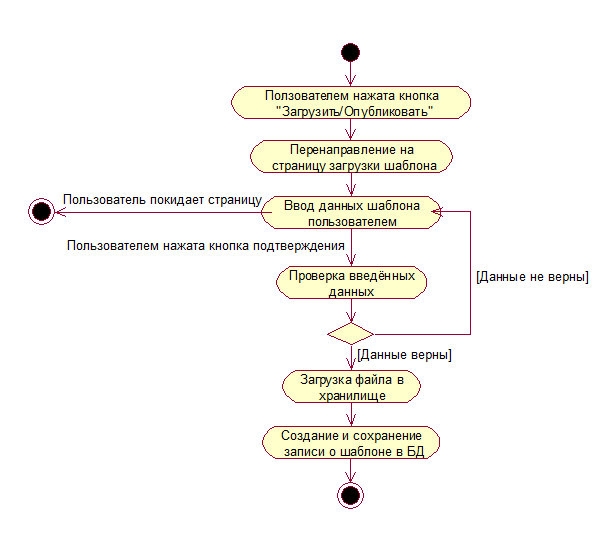
#### 1.2.7. Опубликовать загружаемый шаблон
##### 1.2.7.1. Поток событий
**Описание.** Вариант использования "Опубликовать загружаемый шаблон" позволяет пользователю опубликовать шаблон сразу же после загрузки, чтобы другие пользователи имели возможность просматривать и скачивать шаблон.  
**Предусловия.** Вариант использования "Загрузить шаблон" был выполнен анонимным пользователем или авторизированный пользователь отметил поле "Опубликовать".  

**Основной поток.**  
1. Вариант использования начинается, когда завершился вариант использования "Загрузить шаблон".  
2. Приложение делает загруженный шаблон доступным к просмотру и скачиванию другим пользователями.  
3. Вариант использования завершается.  
##### 1.2.7.2. Диаграмма активности
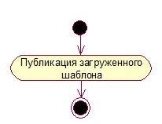
#### 1.2.8. Опубликовать загруженный шаблон
##### 1.2.8.1. Поток событий
**Описание.** Вариант использования "Опубликовать загруженный шаблон" позволяет авторизированному пользователю опубликовать загруженный им ранее шаблон, чтобы другие пользователи имели возможность просматривать и скачивать шаблон.  
**Предусловия.** Авторизированный пользователь находится на странице загруженного им шаблона или на личной странице.  

**Основной поток.**  
1. Вариант использования начинается, когда пользователь нажимает кнопку "Опубликовать".  
2. Приложение делает загруженный шаблон доступным к просмотру и скачиванию другим пользователями.  
3. Вариант использования завершается.  
##### 1.2.8.2. Диаграмма активности
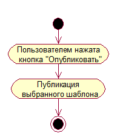
#### 1.2.9. Редактировать шаблон
##### 1.2.9.1. Поток событий
**Описание.** Вариант использования "Редактировать шаблон" позволяет авторизированному пользователю изменить данные загруженного им ранее шаблона.  
**Предусловия.** Авторизированный пользователь находится на странице загруженного им шаблона или на личной странице.  

**Основной поток.**  
1. Вариант использования начинается, когда пользователь нажимает кнопку "Редактировать".  
2. Приложение перенаправляет пользователя на страницу редактирования шаблона.  
3. Пользователь корректирует необходимые данные. Если пользователь покидает страницу, то вариант использования завершается досрочно.  
4. Пользователь нажимает кнопку "Сохранить".  
5. Приложение проверяет введённые данные. Если поле название не заполнено, то выполняется альтернативный поток А1.  
6. Приложение сохраняет изменённую запись о шаблоне в базе данных.  
7. Вариант использования завершается.  

**Альтернативный поток А1.**  
 1. Приложение информирует пользователя о том, что введены не все данные.  
 2. Начинается выполнение пункта 3 основного потока.  
##### 1.2.9.2. Диаграмма активности
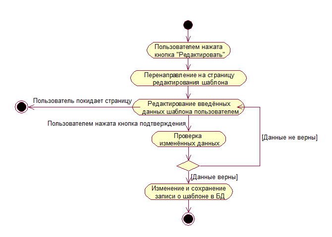
#### 1.2.10. Удалить шаблон
##### 1.2.10.1. Поток событий
**Описание.** Вариант использования "Удалить шаблон" позволяет авторизированному пользователю удалить ранее загруженный им шаблон.  
**Предусловия.** Авторизированный пользователь находится на странице загруженного им шаблона или на личной странице.  
**Основной поток.**  
1. Вариант использования начинается, когда пользователь нажимает кнопку "Удалить".  
2. Приложение удаляет файл шаблона из хранилища.  
3. Приложение удаляет запись о шаблоне из базы данных.  
4. Вариант использования завершается.  
##### 1.2.10.2. Диаграмма активности
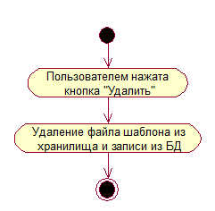
#### 1.2.11. Выйти из учётной записи
##### 1.2.11.1. Поток событий
**Описание.** Вариант использования "Выйти из учётной записи" позволяет пользователю перейти в статус анонимного пользователя.  
**Предусловия.** Пользователь должен быть авторизирован.  

**Основной поток.**  
1. Вариант использования начинается, когда пользователь нажимает кнопку "Выйти".  
2. Приложение перенаправляет пользователя на главную страницу, как анонимного пользователя.  
3. Вариант использования завершается.  
##### 1.2.11.2. Диаграмма активности
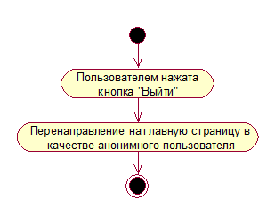
#### 1.2.12. Удалить шаблон, загруженный другим пользователем
##### 1.2.12.1. Поток событий
**Описание.** Вариант использования "Удалить шаблон, загруженный другим пользователем" позволяет администратору удалять шаблоны других пользователей, если они не соответствуют требованиям для публикации.  
**Предусловия.** Администратор должен находится на странице шаблона.  

**Основной поток.**  
1. Вариант использования начинается, когда администратор нажимает кнопку "Удалить".  
2. Приложение удаляет файл шаблона из хранилища.  
3. Приложение удаляет запись о шаблоне из базы данных.  
4. Вариант использования завершается.  
##### 1.2.12.2. Диаграмма активности
Диаграмма активности для сценария "Удалить шаблон, загруженный другим пользователем" аналогична диаграмме для сценария ["Удалить шаблон"](#12102-Диаграмма-активности):  

## 2. Диаграммы последовательности
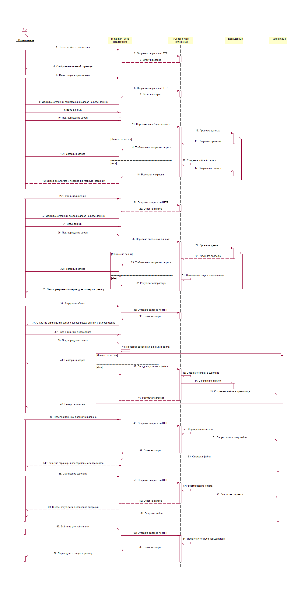
### 2.1. Обмен между приложением и сервером по протоколу HTTP
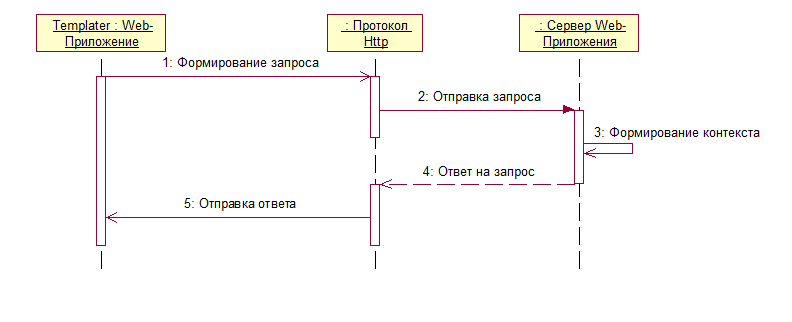
