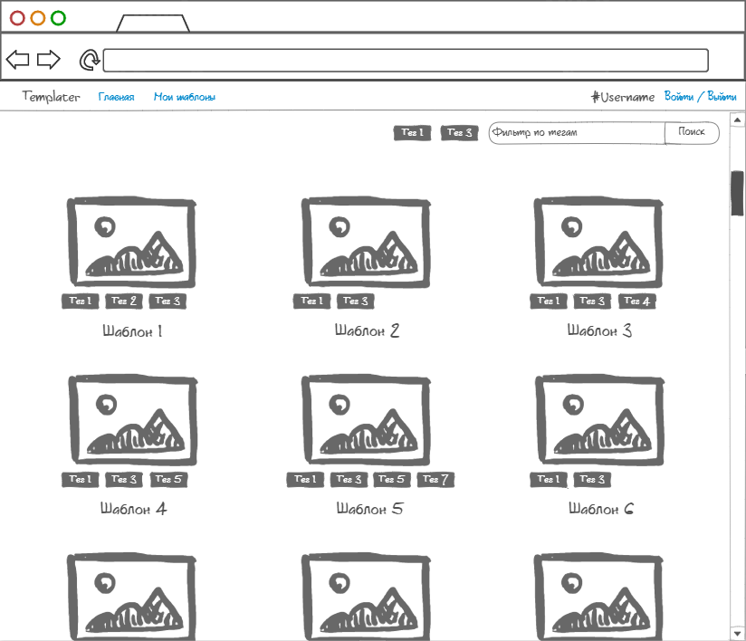
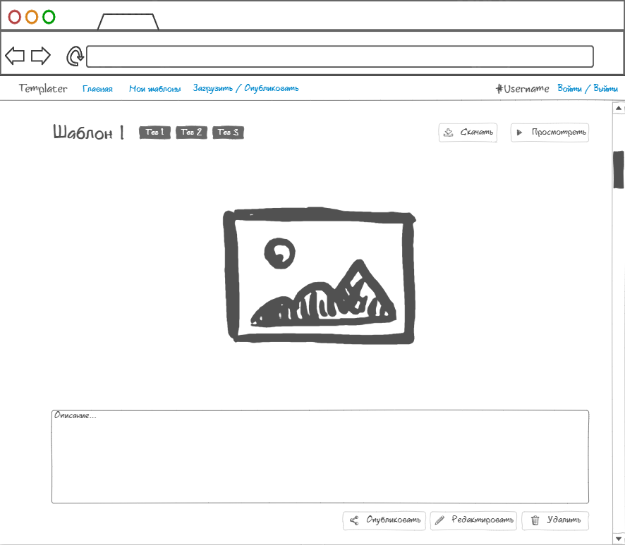
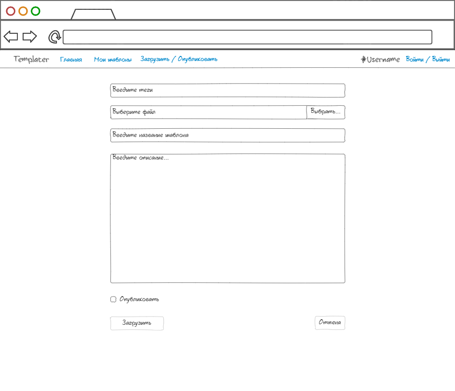

# Требования к проекту
## Содержание
1. [Введение](#P1)  
1.1. [Назначение](#P1.1)  
1.2. [Бизнес-требования](#P1.2)  
&nbsp;&nbsp;&nbsp;&nbsp;1.2.1. [Исходные данные](#P1.2.1)  
&nbsp;&nbsp;&nbsp;&nbsp;1.2.2. [Возможности бизнеса](#P1.2.2)  
1.3. [Аналоги](#P1.3)  
2. [Требования пользователя](#P2)  
2.1. [Программные интерфейсы](#P2.1)  
2.2. [Интерфейс пользователя](#P2.2)  
2.3. [Характеристики пользователей](#P2.3)  
&nbsp;&nbsp;&nbsp;&nbsp;2.3.1. [Классы пользователей](#P2.3.1)  
&nbsp;&nbsp;&nbsp;&nbsp;2.3.2. [Аудитория приложения](#P2.3.2)  
&nbsp;&nbsp;&nbsp;&nbsp;&nbsp;&nbsp;&nbsp;&nbsp;2.3.2.1. [Целевая аудитория](#P2.3.2.1)  
&nbsp;&nbsp;&nbsp;&nbsp;&nbsp;&nbsp;&nbsp;&nbsp;2.3.2.2. [Побочная аудитория](#P2.3.2.2)  
2.4. [Предположения и зависимости](#P2.4)  
3. [Системные требования](#P3)  
3.1. [Функциональные требования](#P3.1)  
&nbsp;&nbsp;&nbsp;&nbsp;3.1.1. [Основные функции](#P3.1.1)  
&nbsp;&nbsp;&nbsp;&nbsp;&nbsp;&nbsp;&nbsp;&nbsp;3.1.1.1. [Загрузка шаблона](#P3.1.1.1)  
&nbsp;&nbsp;&nbsp;&nbsp;&nbsp;&nbsp;&nbsp;&nbsp;3.1.1.2. [Предварительный просмотр шаблона](#P3.1.1.2)  
&nbsp;&nbsp;&nbsp;&nbsp;&nbsp;&nbsp;&nbsp;&nbsp;3.1.1.3. [Скачивание шаблона](#P3.1.1.3)  
&nbsp;&nbsp;&nbsp;&nbsp;&nbsp;&nbsp;&nbsp;&nbsp;3.1.1.4. [Публикация шаблона](#P3.1.1.4)  
&nbsp;&nbsp;&nbsp;&nbsp;&nbsp;&nbsp;&nbsp;&nbsp;3.1.1.5. [Редактирование шаблона](#P3.1.1.5)  
&nbsp;&nbsp;&nbsp;&nbsp;&nbsp;&nbsp;&nbsp;&nbsp;3.1.1.6. [Удаление шаблона](#P3.1.1.6)  
&nbsp;&nbsp;&nbsp;&nbsp;&nbsp;&nbsp;&nbsp;&nbsp;3.1.1.7. [Авторизация пользователя в приложении](#P3.1.1.7)  
&nbsp;&nbsp;&nbsp;&nbsp;&nbsp;&nbsp;&nbsp;&nbsp;3.1.1.8. [Выход авторизированного пользователя из профиля](#P3.1.1.8)  
&nbsp;&nbsp;&nbsp;&nbsp;3.1.2. [Ограничения и исключения](#P3.1.2)  
3.2. [Нефункциональные требования](#P3.2)  
&nbsp;&nbsp;&nbsp;&nbsp;3.2.1. [Атрибуты качества](#P3.2.1)  
&nbsp;&nbsp;&nbsp;&nbsp;&nbsp;&nbsp;&nbsp;&nbsp;3.2.1.1. [Требования к удобству использования](#P3.2.1.1)  
&nbsp;&nbsp;&nbsp;&nbsp;&nbsp;&nbsp;&nbsp;&nbsp;3.2.1.2. [Требования к безопасности](#P3.2.1.2)  
&nbsp;&nbsp;&nbsp;&nbsp;3.2.2. [Внешние интерфейсы](#P3.2.2)  
&nbsp;&nbsp;&nbsp;&nbsp;3.2.3. [Ограничения](#P3.2.3)  
## <a name="P1">1. Введение</a>
### <a name="P1.1">1.1. Назначение </a>
В данном документе описываются функциональные и нефункциональные требования к web-приложению «Templater». Этот документ предназначен для команды, которая будет реализовывать и проверять корректность работы данного приложения.
### <a name="P1.2">1.2. Бизнес-требования</a>
#### <a name="P1.2.1">1.2.1 Исходные данные</a>
В современном мире большую роль в жизни многих людей занимает Интернет. Он упрощает нам множество жизненных аспектов, предоставляя доступ к различного рода информационным ресурсам, представленным в виде сайтов. Сайт - это одна или несколько логически связанных между собой web-страниц, которые созданы с помощь стандартизированного языка разметки <a name="fn1s">HTML</a>[1](#fn1). Поэтому при создании сайта у пользователя возникает необходимость написания HTML-документа.
#### <a name="P1.2.2">1.2.2 Возможности бизнеса</a>
Зачастую при создании сайтов приходится реализовывать web-страницы, аналог которых уже был реализован для другого сайта, примером могут служить страницы приветствия, <a name="fn2s">целевые страницы</a>[2](#fn2), страницы регистрации. Данное приложение позволит пользователю сократить время на разработку сайта, найдя шаблон необходимой пользователю web-страницы среди опубликованных другими пользователями или среди ранее сохранённых своих шаблонов.
### <a name="P1.3">1.3. Аналоги</a>
Основное отличие аналогов - это отсутствие возможности публикации, также многие из них требуют авторизации для просмотра и скачивания даже бесплатных шаблонов. Web-приложение Templater не требует авторизации для скачивания и публикации шаблонов.
- https://templated.co/
  - Отсутствует возможность публикации (шаблоны публикуются небольшим сообществом).
- https://www.free-css.com/
  - Отсутствует возможность публикации.
- https://mobirise.com/
  - Отсутствует возможность публикации.
  - Отсутствует возможность прямого скачивания из браузера.
- https://html-templates.info/
  - Отсутствует возможность публикации.
  - Отсутствует возможность предварительного просмотра в браузере.
## <a name="P2">2. Требования пользователя</a>
### <a name="P2.1">2.1. Программные интерфейсы</a>
- Должна присутствовать возможность предварительного просмотра шаблонов в браузере.
- Должна присутствовать возможность сохранения шаблонов на диск.
- Должна присутствовать возможность загружать шаблоны для публикации или хранения.
### <a name="P2.2">2.2. Интерфейс пользователя</a>
Графический интерфейс пользователя представлен в виде mock-up иллюстраций.

|Описание|Иллюстрация|
|:---|:---|
|Главная страница||
|Личная страница||
|Страница шаблона||
|Страница загрузки шаблона||
### <a name="P2.3">2.3. Характеристики пользователей</a>
#### <a name="P2.3.1">2.3.1. Классы пользователей</a>
|Класс пользователя|Описание|
|:---|:---|
|Анонимный пользователь|Пользователь, который не прошёл процесс авторизации в системе. Имеет частичный доступ к пользовательскому функционалу системы: может просматривать, скачивать и публиковать шаблоны.|
|Авторизированный пользователь|Пользователь, прошедший процесс авторизации в системе под своим именем или псевдонимом. Имеет полный доступ к пользовательскому функционалу системы: может просматривать, скачивать, публиковать, загружать и редактировать собственные шаблоны.|
|Администратор|Пользователь, прошедший процесс авторизации в системе под своим именем или псевдонимом. Имеет полный доступ к функционалу пользовательскому системы и средствам администрирования: удалять опубликованные шаблоны, не удовлетворяющие требованиям для публикации.|
#### <a name="P2.3.2">2.3.2. Аудитория приложения</a>
##### <a name="P2.3.2.1">2.3.2.1. Целевая аудитория</a>
Люди, занимающиеся или обучающиеся разработке сайтов, созданию web-страниц, имеющие минимальное познание в HTML, например, web-дизайнеры, web-разработчики или студенты учреждений образования с техническим профилем в области информационных технологий.
##### <a name="P2.3.2.2">2.3.2.2. Побочная аудитория</a>
Дизайнеры, занимающийся художественно-технической деятельностью в других отраслях отличных от web-разработки, например иллюстраторы, дизайнеры плакатной и рекламной графики, а также люди имеющие отношение к художественной деятельности, связанной с живописью.
### <a name="P2.4">2.4. Предположения и зависимости</a>
- Приложение не будет работать без подключения к сети Интернет.
- Приложение не будет корректно отображать шаблоны при предварительном просмотре, если браузер не поддерживает версию HTML, которая была использована при написании шаблона.
## <a name="P3">3. Системные требования</a>
### <a name="P3.1">3.1. Функциональные требования</a>
#### <a name="P3.1.1">3.1.1. Основные функции</a>
##### <a name="P3.1.1.1.1">3.1.1.1. Загрузка шаблона</a>
**Описание.** Авторизированный пользователь имеет возможность загружать шаблоны для хранения.

|Функция|Требование|
|:---|:---|
|Загрузка шаблона|Приложение должно предоставить возможность пользователю выбрать файл шаблона с диска и загрузить его в приложение.|
##### <a name="P3.1.1.1.2">3.1.1.2. Предварительный просмотр шаблона</a>
**Описание.** Пользователь имеет возможность просмотреть шаблон в приложении не скачивая его на диск.

|Функция|Требование|
|:---|:---|
|Предварительный просмотр шаблона|Приложение должно предоставить возможность просмотреть выбранный шаблон в браузере без загрузки на диск.|
##### <a name="P3.1.1.1.3">3.1.1.3. Скачивание шаблона</a>
**Описание.** Пользователь имеет возможность скачивать шаблоны на диск.

|Функция|Требование|
|:---|:---|
|Скачивание шаблона|Приложение должно предоставить возможность скачивать выбранный шаблон из приложения на диск.|
##### <a name="P3.1.1.1.4">3.1.1.4. Публикация шаблона</a>
**Описание.** Пользователь имеет возможность опубликовать шаблон для скачивания другими пользователями.

|Функция|Требование|
|:---|:---|
|Публикация шаблона при загрузке|Приложение должно предоставить возможность опубликовать загружаемый шаблон.|
|Публикация загруженного шаблона|Приложение должно предоставить возможность опубликовать уже загруженный шаблон.|
##### <a name="P3.1.1.1.5">3.1.1.5. Редактирование шаблона</a>
**Описание.** Авторизированный пользователь имеет возможность редактировать загруженный им шаблон.

|Функция|Требование|
|:---|:---|
|Редактирование шаблона|Приложение должно предоставить авторизированному пользователю возможность отредактировать данные о загруженном им шаблоне и/или выбрать и загрузить новый файл шаблона.|
##### <a name="P3.1.1.1.6">3.1.1.6. Удаление шаблона</a>
**Описание.** Пользователь имеет возможность удалить выбранные шаблоны.

|Функция|Требование|
|:---|:---|
|Удаление шаблонов авторизированным пользователем|Приложение должно предоставить авторизированному пользователю возможность удалить шаблоны, которые были загружены им.|
|Удаление шаблонов администратором|Приложение должно предоставить администратору возможность удалять шаблоны, которые не удовлетворяют требованиям для публикации.|
##### <a name="P3.1.1.1.7">3.1.1.7. Авторизация пользователя в приложении</a>
**Описание.** Пользователь имеет возможность авторизироваться в приложении либо пользоваться им анонимно.

|Функция|Требование|
|:---|:---|
|Вход в приложение без собственного профиля|Приложения должно предоставить возможность пользователю зайти в приложение анонимно.|
|Регистрация нового профиля пользователя|Приложение должно предоставить возможность создания профиля пользователя, запросив у него имя и пароль для создания профиля.|
|*Пользователь с таким именем уже существует*|Приложение должно известить пользователя об ошибке при попытке регистрации и запросить повторный ввод данных.|
|Вход в приложение с использованием существующего профиля пользователя|Приложение должно предоставить пользователю возможность авторизироваться в системе, запросив у него имя и пароль.|
##### <a name="P3.1.1.1.8">3.1.1.8. Выход авторизированного пользователя из профиля</a>
**Описание.** Авторизированный пользователь имеет возможность выйти из своего профиля пользователя.

|Функция|Требование|
|:---|:---|
|Выход авторизированного пользователя из профиля|Приложения должно предоставить возможность авторизированному пользователю выйти из своего профиля пользователя и вернуть его на главную страницу в качестве анонимного пользователя.|
#### <a name="P3.1.2">3.1.2. Ограничения и исключения</a>
- Приложение может работать только при активном подключения к сети Интернет.
### <a name="P3.2">3.2. Нефункциональные требования</a>
#### <a name="P3.2.1">3.2.1. Атрибуты качества</a>
##### <a name="P3.2.1.1">3.2.1.1. Требования к удобству использования</a>
- Приложение должно предоставлять единообразный вид между всеми web-страницами.
- Приложение должно предоставлять миниатюрное изображение для каждого шаблона.
- Приложение должно предоставлять поддержку нескольких языков.
##### <a name="P3.2.1.2">3.2.1.2. Требования к безопасности</a>
- Приложение должно предоставлять возможность контролировать шаблоны на соответствие требованиям для публикации.
#### <a name="P3.2.2">3.2.2. Внешние интерфейсы</a>
Окна приложения удобны для использования пользователями с плохим зрением:
- Размер шрифта не менее 7 пт.
- Функциональные элементы контрастны фону окна.
#### <a name="P3.2.3">3.2.3. Ограничения</a>
- Профили пользователей и данные о шаблонах хранятся в базе данных.
- Файлы шаблонов хранятся в сетевом хранилище.

---
<a name="fn1">[1](#fn1s)</a>: HTML (англ. HyperText Markup Language) — язык гипертекстовой разметки.  
<a name="fn2">[2](#fn2s)</a>: Целевая страница (англ. landing page) — страница для сбора данных целевой аудитории.  
