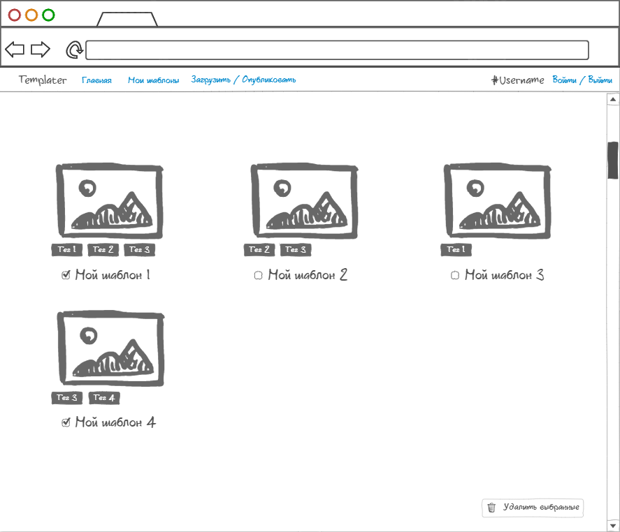

# Требования к проекту
## Содержание
1. [Введение](#P1)  
1.1. [Назначение](#P1.1)  
1.2. [Бизнес-требования](#P1.2)  
&nbsp;&nbsp;&nbsp;&nbsp;1.2.1. [Исходные данные](#P1.2.1)  
&nbsp;&nbsp;&nbsp;&nbsp;1.2.2. [Возможности бизнеса](#P1.2.2)  
1.3. [Аналоги](#P1.3)  
2. [Требования пользователя](#P2)  
2.1. [Программные интерфейсы](#P2.1)  
2.2. [Интерфейс пользователя](#P2.2)  
2.3. [Характеристики пользователей](#P2.3)  
&nbsp;&nbsp;&nbsp;&nbsp;2.3.1. [Классы пользователей](#P2.3.1)  
&nbsp;&nbsp;&nbsp;&nbsp;2.3.2. [Аудитория приложения](#P2.3.2)  
&nbsp;&nbsp;&nbsp;&nbsp;&nbsp;&nbsp;&nbsp;&nbsp;2.3.2.1. [Целевая аудитория](#P2.3.2.1)  
&nbsp;&nbsp;&nbsp;&nbsp;&nbsp;&nbsp;&nbsp;&nbsp;2.3.2.2. [Побочная аудитория](#P2.3.2.2)  
2.4. [Предположения и зависимости](#P2.4)  
3. [Системные требования](#P3)  
## <a name="P1">1. Введение</a>
### <a name="P1.1">1.1. Назначение </a>
В данном документе описываются функциональные и нефункциональные требования к web-приложению «Templater». Этот документ предназначен для команды, которая будет реализовывать и проверять корректность работы данного приложения.
### <a name="P1.2">1.2. Бизнес-требования</a>
#### <a name="P1.2.1">1.2.1 Исходные данные</a>
В современном мире большую роль в жизни многих людей занимает Интернет. Он упрощает нам множество жизненных аспектов, предоставляя доступ к различного рода информационным ресурсам, представленным в виде сайтов. Сайт - это одна или несколько логически связанных между собой web-страниц, которые созданы с помощь стандартизированного языка разметки <a name="fn1s">HTML</a>[1](#fn1). Поэтому при создании сайта у пользователя возникает необходимость написания HTML-документа.
#### <a name="P1.2.2">1.2.2 Возможности бизнеса</a>
Зачастую при создании сайтов приходится реализовывать web-страницы, аналог которых уже был реализован для другого сайта, примером могут служить страницы приветствия, <a name="fn2s">целевые страницы</a>[2](#fn2), страницы регистрации. Данное приложение позволит пользователю сократить время на разработку сайта, найдя шаблон необходимой пользователю web-страницы среди опубликованных другими пользователями или среди ранее сохранённых своих шаблонов.
### <a name="P1.3">1.3. Аналоги</a>
Основное отличие аналогов - это отсутствие возможности публикации, также многие из них требуют авторизации для просмотра и скачивания даже бесплатных шаблонов. Web-приложение Templater не требует авторизации для скачивания и публикации шаблонов.
- https://templated.co/
  - Отсутствует возможность публикации (шаблоны публикуются небольшим сообществом).
- https://www.free-css.com/
  - Отсутствует возможность публикации.
- https://mobirise.com/
  - Отсутствует возможность публикации.
  - Отсутствует возможность прямого скачивания из браузера.
- https://html-templates.info/
  - Отсутствует возможность публикации.
  - Отсутствует возможность предварительного просмотра в браузере.
## <a name="P2">2. Требования пользователя</a>
### <a name="P2.1">2.1. Программные интерфейсы</a>
- Должна присутствовать возможность предварительного просмотра шаблонов в браузере.
- Должна присутствовать возможность сохранения шаблонов на диск.
- Должна присутствовать возможность загружать шаблоны для публикации или хранения.
### <a name="P2.2">2.2. Интерфейс пользователя</a>
Графический интерфейс пользователя представлен в виде mock-up иллюстраций.
### 
|Описание|Иллюстрация|
|:---|:---|
|Главная страница||
|Личная страница||
|Страница шаблона||
|Страница загрузки шаблона||
### <a name="P2.3">2.3. Характеристики пользователей</a>
#### <a name="P2.3.1">2.3.1. Классы пользователей</a>
|Класс пользователя|Описание|
|:---|:---|
|Анонимный пользователь|Пользователь, который не прошёл процесс авторизации в системе. Имеет частичный доступ к пользовательскому функционалу системы: может просматривать, скачивать и публиковать шаблоны.|
|Авторизированный пользователь|Пользователь, прошедший процесс авторизации в системе под своим именем или псевдонимом. Имеет полный доступ к пользовательскому функционалу системы: может просматривать, скачивать, публиковать, загружать и редактировать собственные шаблоны.|
|Администратор|Пользователь, прошедший процесс авторизации в системе под своим именем или псевдонимом. Имеет полный доступ к функционалу пользовательскому системы и средствам администрирования: удалять опубликованные шаблоны, не удовлетворяющие требованиям качества для публикации.|
#### <a name="P2.3.2">2.3.2. Аудитория приложения</a>
##### <a name="P2.3.2.1">2.3.2.1. Целевая аудитория</a>
Люди, занимающиеся или обучающиеся разработке сайтов, созданию web-страниц, имеющие минимальное познание в HTML, например, web-дизайнеры, web-разработчики или студенты учреждений образования с техническим профилем в области информационных технологий.
##### <a name="P2.3.2.2">2.3.2.2. Побочная аудитория</a>
Дизайнеры, занимающийся художественно-технической деятельностью в других отраслях отличных от web-разработки, например иллюстраторы, дизайнеры плакатной и рекламной графики, а также люди имеющие отношение к художественной деятельности, связанной с живописью.
### <a name="P2.4">2.4. Предположения и зависимости</a>
- Приложение не будет работать без подключения к сети Интернет.
- Приложение не будет корректно отображать шаблоны при предварительном просмотре, если браузер не поддерживает его версию HTML.
## <a name="P3">3. Системные требования</a>
...

<a name="fn1">[1](#fn1s)</a>: HyperText Markup Language — язык гипертекстовой разметки.  
<a name="fn2">[2](#fn2s)</a>: Целевая страница (англ. landing page) — страница для сбора данных целевой аудитории.  
